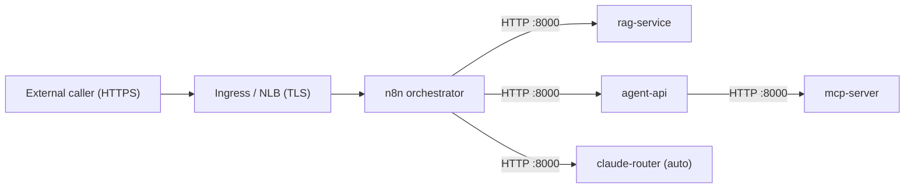

# Agent Platform — Mini Project Game Plan

> **Goal:** Build a production-minded AI agent platform on Kubernetes (EKS),
> orchestrated by n8n, with a portable design so services aren't coupled to
> Kubernetes internals (config via env vars, no K8s objects in app code).
>
> **Starting point:** This supersedes Themes 1-4 and continues from the current state.
> n8n + `rag-service` + `agent-api` + `mcp-server` already deploy and destroy cleanly
> on dev EKS in `eu-central-1`. Some dev infrastructure is kept **always-on** to speed
> iteration (cost-managed).

---

## Guiding Principles

1. **Agent = image + spec + config** — the agent contract is the product, not the orchestrator.
2. **Runtime-agnostic first** — no Kubernetes-only objects inside agent code; all config via env vars so services stay portable.
3. **AWS-native from day one** — ECR for images, Bedrock for LLM, Secrets Manager for secrets, CloudWatch for logs/metrics.
4. **HTTPS at the edge** — plain HTTP is fine **inside the cluster / AWS account**; HTTPS is required **only at the external ingress**.
5. **Every service must have** a `Dockerfile`, a `/health` endpoint, env-based config, and a defined port. No exceptions.
6. **eu-central-1 only** — all resources in Frankfurt unless a technical limit forces an exception (approved first).

---

## Invocation Model

n8n is the **front door / orchestrator**. External callers hit an n8n webhook
(`/webhook/ai-orchestrator`); n8n routes and chains calls to the services over
**in-cluster HTTP on port 8000** (e.g. `http://rag-service.dev.svc.cluster.local:8000/query`). The agents
themselves are **internal only** (`ClusterIP`, port **8000**, not internet-routable) — only n8n is exposed externally,
and only n8n's ingress terminates **HTTPS** (HTTP:80 on ALB redirects to HTTPS; HSTS enabled).



**Future option (keep in mind, do NOT implement yet):** direct per-agent HTTPS
invocation (`POST /invoke` + bearer token), where each agent is independently
callable and n8n becomes just one of several clients. We start with the **n8n
approach only**.

---

## Repo Inventory & Role in This Plan

| Repo | Language | Private | Role in Plan | Action |
|---|---|---|---|---|
| `ai-platform` | Python | No | **Core monorepo** — n8n orchestration, rag-service, home of GAMEPLAN | Primary workspace |
| `agent-api` | Python | Yes | **Core** — agent gateway, has Dockerfile + k8s/ + app/ + llm/ | Add `agent-spec.yaml` |
| `rag-service` | Python | Yes | **Core** — RAG backend, clean Dockerfile, env-based config | Add `k8s/` manifests + `agent-spec.yaml` |
| `mcp-server` | Python | No | **Core** — MCP tool server, has Dockerfile + k8s/ + tools/ | Verify `/health`, add `agent-spec.yaml` |
| `infrastructure` | HCL | Yes | **Supporting** — Terraform; add ECR repos, IAM roles, Secrets Manager | Add `ecr.tf`, `iam.tf` for agents |
| `cicd` | Shell | Yes | **Supporting** — CI/CD pipelines; extend to build/push agent images to ECR | Add ECR push step per agent |
| `microservices` | — | Yes | **Reference** — existing service patterns to reuse in agent adapters | Read-only reference |
| `peakyblinders` | Dockerfile | No | **Reference** — container build patterns | Read-only reference |
| `moviescicd` | Python | No | **Reference** — CI/CD patterns for Python services | Read-only reference |
| `APIs` | Python | No | **Reference** — FastAPI patterns reusable in new agent | Read-only reference |
| `azurepipeline` | HCL | No | **Not relevant** — Azure-specific, skip | No action |
| `WorldOfGames` | Python | No | **Not relevant** — old learning project, skip | No action |

---

## Repo Structure (target)
```
ai-platform/                       ← primary workspace
├── agents/
│   └── support-runbook-copilot/   ← first agent (starter use case)
│       ├── Dockerfile
│       ├── app/
│       ├── agent-spec.yaml        ← agent contract (documentation)
│       └── k8s/
│           ├── deployment.yaml
│           ├── service.yaml
│           ├── hpa.yaml
│           └── secret.yaml
├── rag-service/                   ← existing ✅ — add k8s/
├── n8n/
│   └── k8s/                       ✅ exists
├── infra/                         ← mirrors infrastructure repo (single TF source of truth lives in `infrastructure`)
│   ├── ecr.tf
│   ├── iam.tf
│   ├── eks.tf
│   └── secrets.tf
└── GAMEPLAN.md
```

Cross-repo dependencies:
- `agent-api` → add `agent-spec.yaml`
- `mcp-server` → verify `/health`, add `agent-spec.yaml`
- `infrastructure` → add ECR repos + IAM task roles for agents
- `cicd` → add ECR image push step per agent

---

## Agent Spec Format

Every agent has an `agent-spec.yaml` at its root. It is **documentation** of the agent's
contract — a single human-readable page describing the agent. K8s manifests are written
to match it **by hand** (it is not a generator; there is no auto-derivation).

```yaml
apiVersion: agents.platform/v1alpha1
kind: Agent
metadata:
  name: support-runbook-copilot
  version: "1.0.0"
  description: >
    Advises on incidents by retrieving runbooks and generating a suggested action plan.

spec:
  runtime:
    image: <ECR_ACCOUNT>.dkr.ecr.eu-central-1.amazonaws.com/agents/support-runbook-copilot:1.0.0
    port: 8080                     # app/container port (in-cluster HTTP)
    healthcheck:
      path: /health
      intervalSeconds: 30

  invocation:
    mode: orchestrated             # reached via n8n, not called directly (for now)
    transport:
      protocol: http               # in-cluster; TLS is terminated at the n8n ingress, not here
    endpoint: /invoke
    method: POST

  llm:
    provider: bedrock
    model: eu.anthropic.claude-sonnet-4-20250514-v1:0   # Sonnet 4, EU cross-region inference profile
                                                        # (confirmed in use by rag-service / agent-api)
    temperature: 0.2
    maxTokens: 1200

  security:
    runAsNonRoot: true
    secrets:
      - name: bedrock-credentials
    # Bedrock access is controlled by IAM via IRSA (least-privilege task role),
    # NOT by NetworkPolicy (native K8s NetworkPolicy can't match DNS names).
    # Future option for network-level control: Bedrock VPC endpoint (PrivateLink).

  scalability:
    min_instances: 2
    max_instances: 10
    scale_metric: cpu
    scale_target: 60

  resources:
    cpu: "500m"
    memory: "1Gi"

  observability:
    logging:
      level: info
      format: json
    metrics:
      enabled: true
    audit:
      logInputs: true
      logToolCalls: true
      redactSecrets: true
```

---

## Phase 1 — Foundation

### 1.1 Local dev environment (optional)
- [ ] (Optional) Install `kind` or `minikube` for cheap local iteration
- [ ] Configure `kubectl` context (dev EKS is the primary target)
- [ ] Confirm AWS CLI profile with Bedrock + ECR access (`eu-central-1`)

### 1.2 ECR setup (extends `infrastructure` repo)
- [x] ECR repos managed in Terraform via `modules/ecr`: `rag-service`, `mcp-server`, `agent-api` (adopted)
- [x] Add lifecycle policy: keep last 5 images, expire untagged after 1 day
- [ ] `support-runbook-copilot` repo — add in Phase 2 (deferred)
- [ ] Test: build `rag-service` image → push to ECR → pull back

### 1.3 Standardize existing services

**rag-service** (standalone repo is the deployed one; `ai-platform/rag-service` is a code copy):
- [x] `/health` present (`app/main.py`)
- [x] Helm chart at `k8s/helm/` already exists (Service is `ClusterIP`); added missing `hpa.yaml` (gated by `autoscaling.enabled`)
- [x] Add `agent-spec.yaml`

**agent-api** (existing repo — Dockerfile + `k8s/helm/`, HPA on):
- [x] Add `agent-spec.yaml`
- [x] `/health` present (`app/main.py`)

**mcp-server** (existing repo — FastMCP, streamable-HTTP on `/mcp`):
- [x] Add `agent-spec.yaml`
- [x] Added `/health` via FastMCP `custom_route`; switched probes from tcpSocket to httpGet `/health`

---

## Phase 2 — First Agent

### 2.1 support-runbook-copilot (new agent)
- [ ] Create `agents/support-runbook-copilot/`
- [ ] Write `agent-spec.yaml` (use template above)
- [ ] Build minimal FastAPI app (`app/main.py`):
  - `POST /invoke` — accepts `incident_summary`, calls Bedrock Claude, returns action plan
  - `GET /health` — returns `{"status": "ok"}`
- [ ] `Dockerfile` — mirror `rag-service` pattern (python:3.11-slim, uvicorn, port 8080)
- [ ] `requirements.txt` + `.env.example`

### 2.2 K8s adapter for the agent
- [ ] `k8s/deployment.yaml` — driven by `scalability` block in agent-spec
- [ ] `k8s/service.yaml` (`ClusterIP` — internal only)
- [ ] `k8s/hpa.yaml` — min/max from agent-spec, CPU target 60%
- [ ] Deploy to dev EKS and exercise it **through the n8n orchestrator** end-to-end

### 2.3 Wire the agent into n8n
- [ ] Add a route/branch in the orchestrator workflow that calls the new agent over in-cluster HTTP
- [ ] Test the full path: n8n webhook → agent `/invoke` → response

---

## Phase 3 — Observability & Security

- [ ] All services log JSON to stdout (CloudWatch picks it up on EKS)
- [ ] Add CloudWatch log group per service in `infra/`
- [ ] IAM task roles — least-privilege: Bedrock + ECR + Secrets Manager (extends `infrastructure` repo)
- [ ] `runAsNonRoot: true` in all K8s deployments
- [ ] Only n8n exposed via HTTPS ingress; agents stay `ClusterIP` (internal HTTP)
- [ ] Basic CloudWatch dashboard: invocations, latency p99, error rate
- [ ] Extend `cicd` repo — add ECR image build + push step per agent on merge to main

---

## Portability Checklist

Keeps services from being locked to Kubernetes internals:

- [ ] No K8s-specific objects inside application code
- [ ] All config from env vars only
- [ ] Single process per container (no sidecars baked in)
- [ ] `/health` responds within 5s
- [ ] Image in ECR with a versioned tag (not `latest`)

---

## Key Design Decisions

| Decision | Choice | Rationale |
|---|---|---|
| Orchestrator | Kubernetes (EKS) | Primary runtime; optional local kind for dev |
| Front door | n8n | External entrypoint that routes/chains calls to agents |
| Image registry | Amazon ECR | One repo per service, versioned tags |
| LLM provider | Amazon Bedrock | Claude Sonnet 4 (`eu.anthropic.claude-sonnet-4-20250514-v1:0`, EU inference profile) |
| Secret management | AWS Secrets Manager | Accessed on EKS via IRSA |
| Config pattern | Env vars only | Keeps services portable |
| Invocation | n8n webhook → internal HTTP | Agents are internal; only n8n is exposed via HTTPS ingress |
| Autoscaling signal | CPU 60% | HPA |
| Logging | JSON to stdout | Picked up by CloudWatch, no agent change needed |
| Region | `eu-central-1` | Frankfurt-only unless a technical limit forces otherwise |

---

## Current Status Across All Repos

| Service | Dockerfile | Health endpoint | Env config | K8s manifests | agent-spec |
|---|---|---|---|---|---|
| rag-service | ✅ | ✅ | ✅ | ✅ Helm chart (+ HPA template added) | ✅ |
| agent-api | ✅ | ✅ | ✅ | ✅ Helm chart (HPA on) | ✅ |
| mcp-server | ✅ | ✅ (added `/health` + httpGet probes) | ✅ | ✅ Helm chart | ✅ |
| n8n | upstream image | N/A | ✅ | ✅ HTTPS @ n8n.levkesha.com | N/A |
| claude-router | ✅ | ✅ | ✅ | ✅ k8s in ai-platform | N/A |
| support-runbook-copilot | ❌ create | ❌ create | ❌ create | ❌ create | ❌ create |

---

## Session wrap — 2026-06-13 (Theme 4 / n8n HTTPS)

### Done this session

- **n8n HTTPS live:** `https://n8n.levkesha.com` — ACM cert, ALB (TLS 1.3 policy), HTTP→HTTPS redirect, HSTS, `N8N_EDITOR_BASE_URL`
- **Orchestrator workflow:** `lastNode` webhook mode; `:8000` backend URLs; rag/agent/auto/invalid-mode tested
- **claude-router:** deployed in `dev` (ECR, IRSA trust, Sonnet model, Service port 8000)
- **Security:** NetworkPolicies (`k8s/network-policies/dev-backends.yaml`); all ClusterIP services on **port 8000** (not 80)
- **Terraform (infrastructure):** LBC IRSA, ACM, subnet ELB tags (gated `enable_*`); namespaces module fix for `manage_kubernetes_resources=false`
- **Cursor skills:** `aws-dns-delegation`, `n8n-claude-router`; updates to n8n-deploy/api/workflows, aws-alb, aws-iam-least-privilege
- **Repos pushed:** ai-platform, infrastructure, agent-api, rag-service, mcp-server (port 8000 + MCP/RAG URL fixes)

### Live endpoints (when scaled up)

| URL | Purpose |
|-----|---------|
| `https://n8n.levkesha.com` | n8n UI + owner setup |
| `https://n8n.levkesha.com/webhook/ai-orchestrator` | Orchestrator webhook (production) |
| Workflow ID | `JW6BZO6PZnExaOa5` |

### Spin-down (end of session)

Workloads scaled to **0 replicas** in `dev` and `n8n` namespaces to save compute; **EKS, RDS, ALB** remain (always-on dev infra). To bring back:

```bash
kubectl -n dev scale deploy/rag-service deploy/agent-api deploy/mcp-server deploy/claude-router --replicas=1
kubectl -n n8n scale deploy/n8n --replicas=1
# agent-api/rag-service may need helm upgrade if values drifted
```

### Next session priorities

1. **Codify imperative infra in Terraform** — import LBC role, ACM cert; `enable_*` apply when ready
2. **claude-router CI** — GitHub Action build/push (like agent-api); add ECR repo to Terraform
3. **Optional hardening** — WAF / `inbound-cidrs` on n8n ingress; codify claude-router IRSA in TF
4. **Phase 2** — support-runbook-copilot agent (when Theme 4 stable)
5. **Destroy/redeploy smoke** — run `terraform-destroy-dev` workflow green after changes

### Key ARNs / IDs

| Resource | Value |
|----------|-------|
| ACM (n8n) | `arn:aws:acm:eu-central-1:126366239504:certificate/e2886bca-78d5-4e90-9b04-2526ad4446ce` |
| Route53 zone (levkesha.com) | `Z06888972YCZFH8ESA559` |
| EKS cluster | `dev-cluster`, `eu-central-1` |
| Bedrock model (prod path) | `eu.anthropic.claude-sonnet-4-5-20250929-v1:0` |

### Agent/skill catalog (use next time)

| Task | Delegate |
|------|----------|
| n8n workflow / webhook / import | `n8n-general` → n8n-workflows, n8n-api |
| claude-router / auto mode | `n8n-claude-router` |
| AWS ALB/ACM/Route53 | `aws-general` |
| DNS delegation issues | `aws-dns-delegation` |
| Terraform plan/apply | `terraform` agent |
| GitHub CI / commits | `github` → repo agents |

> **Convention note:** each service ships its own Helm chart under `k8s/helm/` and is
> deployed by its own repo's CI (not raw `k8s/` manifests). `infrastructure/charts/rag-service`
> is legacy/unwired. All Services are `ClusterIP` (internal, port **8000**); only n8n is exposed externally (HTTPS at ALB).

> **ECR note:** `modules/ecr` now carries a lifecycle policy (keep last 5, expire untagged
> after 1 day). `rag-service`, `mcp-server`, and `agent-api` are all Terraform-managed
> (agent-api adopted via import/preserve). `support-runbook-copilot` repo is deferred to Phase 2.
